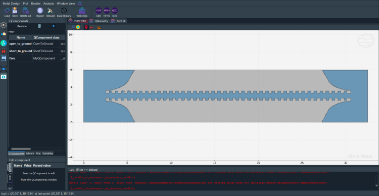
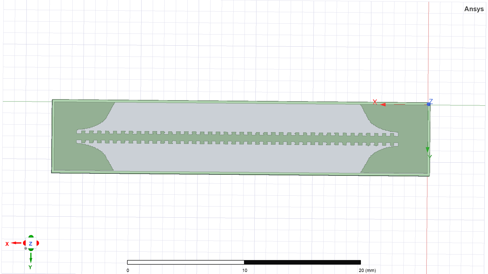
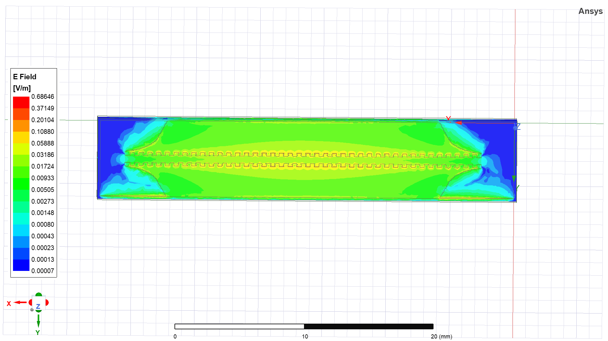
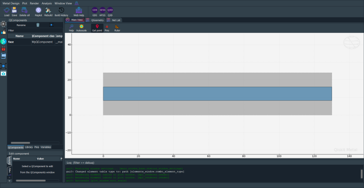
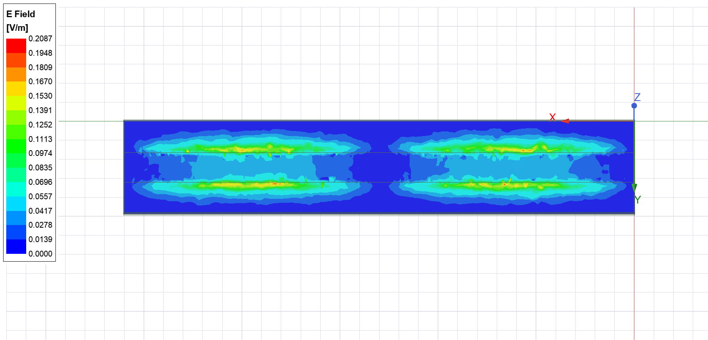
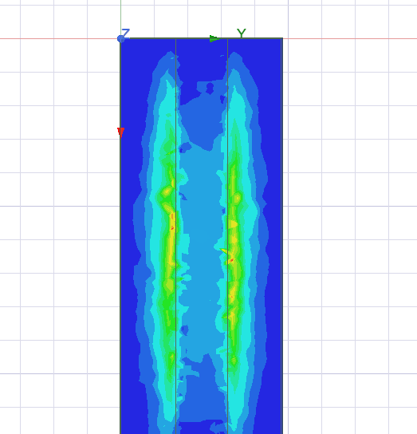

# Qiskit Metal - Qlib creation

Import component to Qiskit Metal using Image

## Features

- Scaling
- Automatic image converting to correct formats
- Exporting to Ansys
- GDSII Creation

## Demonstration

#### WorkFlow

#### Image to be imported to Qiskit

#### Qiskit Metal design - Plasmon TL

#### Ansys Sim - EPR

#### Simple Qiskit

#### Simple Ansys

#### Simple Ansys

## Appendix

Any additional information goes here

## Documentation

[QMetal](https://qiskit.org/documentation/metal/)
[Pillow](https://pillow.readthedocs.io/en/stable/)

